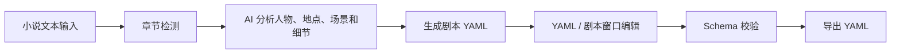

# Novel2Script

Novel2Script 是一款面向小说作者的 AI 小说转剧本工具。它可以将 3 个章节以上的小说文本转换为结构化剧本 YAML，让作者获得可编辑、可校验、可继续打磨的剧本初稿。

## 项目简介

小说改编剧本时，作者通常需要反复整理章节、人物、地点、场景、动作、对白和转场。Novel2Script 将这个流程拆成清晰的产品链路：先检测小说章节，再调用 OpenAI-compatible 接口生成结构化剧本 YAML，最后让作者继续编辑、校验并导出结果。

本项目不把 AI 输出当成最终稿，而是把它变成可追踪、可修改、可复用的结构化初稿。当前 schema 已扩展到细节版 `1.1.0`，用于保留画面氛围、关键道具、感官细节、动作线、人物动作、对白动作和完整场景正文，降低后续漫剧/分镜改编时的幻觉风险。

## 赛题对应说明

本项目对应赛题：**题目三：AI 小说转剧本工具**

覆盖内容：
- 支持输入 3 个章节以上小说文本。
- 支持 AI 自动转换为结构化剧本。
- 输出 YAML 格式。
- 提供 YAML Schema 文档。
- Schema 文档说明字段设计原因。
- 提供 README。
- 预留 Demo 视频链接。
- 项目可在本地运行和评审。

## 核心功能

1. **多章节小说输入**  
   用户可以在首页粘贴小说文本，适合输入 3 个章节以上的故事内容。

2. **章节数量自动检测**  
   系统识别 `第一章`、`第1章`、`章节一`、`Chapter 1`、Markdown 标题等常见章节格式，并展示章节列表。

3. **示例小说加载**  
   首页提供原创三章节示例小说，评委可以一键加载并快速体验完整流程。

4. **AI 小说转剧本 YAML**  
   前端调用 `/api/generate`，后端通过 OpenAI-compatible Chat Completions API 生成结构化剧本 YAML。

5. **细节版 YAML Schema**  
   Schema `1.1.0` 不只保存大纲，还保存场景正文、画面氛围、关键道具、感官细节、动作线、人物动作和对白动作。

6. **YAML 在线编辑**  
   AI 生成结果会进入可编辑 YAML 编辑器，用户可以继续修改字段、场景和对白。

7. **剧本修改窗口**  
   用户点击“修改剧本”后，会打开更适合剧作家阅读的窗口。修改正文、动作、画面细节、对白后，系统会统一同步回 YAML。

8. **YAML Schema 校验**  
   前端调用 `/api/validate`，后端使用 `js-yaml` 解析 YAML，并通过手写 schema 校验逻辑检查结构。

9. **YAML 一键导出**  
   用户可以将当前编辑器中的内容导出为 `novel2script-output.yaml`。

## YAML 数据层与剧本修改窗口

Novel2Script 同时提供两个编辑入口：

- **YAML 数据层**：生成完成后优先展示，用于结构化校验、手动微调和导出。
- **剧本修改窗口**：点击“修改剧本”后打开，用更接近剧作家工作习惯的方式展示标题、梗概、场景正文、画面细节、动作线、剧情节拍、人物动作、对白和转场。

当作者点击“应用修改到 YAML”时，系统会更新同一个结构化对象，并重新生成 YAML。预览窗口中的每个编辑区都对应明确的 YAML 路径，例如 `scenes[0].screenplay_text`、`scenes[0].visual.key_props`、`scenes[0].beats[0].character_actions`，确保修改能精准落到 YAML 字段。

## 产品流程



## 技术栈

- Next.js App Router
- React
- TypeScript
- Tailwind CSS
- js-yaml
- OpenAI-compatible API
- Node.js

## 目录结构

```text
app/          Next.js App Router 页面与 API Route
components/   前端 UI 组件
lib/          章节检测、LLM 调用、Prompt、YAML 解析和 Schema 校验
docs/         Schema 文档、Demo 指南和提交检查清单
examples/     示例小说输入和示例 YAML 输出
```

## 本地启动

1. 安装依赖：

```bash
npm install
```

2. 复制环境变量文件：

```bash
cp .env.example .env.local
```

3. 配置模型 API：

```text
OPENAI_API_KEY=你的 API Key
OPENAI_BASE_URL=OpenAI-compatible API 地址，可选
OPENAI_MODEL=模型名称，可选
```

4. 启动项目：

```bash
npm run dev
```

5. 打开浏览器访问：

```text
http://localhost:3000
```

## 环境变量说明

`OPENAI_API_KEY`  
模型服务 API Key，不可提交到仓库。

`OPENAI_BASE_URL`  
OpenAI-compatible API 地址。未配置时默认使用 `https://api.openai.com/v1`。

`OPENAI_MODEL`  
模型名称。未配置时默认使用 `gpt-4o-mini`。

## 使用方式

1. 打开首页。
2. 点击“加载示例小说”或粘贴自己的小说文本。
3. 确认检测到 3 个章节以上。
4. 点击“生成剧本 YAML”。
5. 查看并编辑生成结果。
6. 点击“修改剧本”，在预览窗口中编辑正文、画面、动作和对白。
7. 点击“应用修改到 YAML”。
8. 点击“校验 YAML”。
9. 校验通过后点击“导出 YAML”。

## YAML Schema 文档

完整文档见：[docs/yaml-schema.md](docs/yaml-schema.md)

当前 Schema 顶层结构：
- `script`
- `chapters`
- `characters`
- `locations`
- `scenes`
- `metadata`

## 示例文件

- [examples/sample-novel.md](examples/sample-novel.md)：原创三章节小说示例。
- [examples/sample-script.yaml](examples/sample-script.yaml)：符合 Schema `1.1.0` 的细节版剧本 YAML 示例。

## Demo 视频

Demo 视频链接：待补充

最终提交前需要替换为可访问的视频链接，例如 bilibili、网盘或其他公开可访问平台。

## 原创功能说明

本项目原创实现部分包括：
- 小说章节检测逻辑。
- 细节版剧本 YAML Schema 设计。
- AI 小说转剧本 Prompt。
- YAML 结构校验逻辑。
- YAML 编辑、剧本窗口修改、校验和导出流程。
- 示例小说与示例 YAML。

## 当前开发进度

项目已经完成：
- 输入 3 章以上小说。
- 章节数量检测。
- 示例小说加载。
- AI 生成剧本 YAML。
- 细节版 Schema `1.1.0`。
- YAML 编辑。
- 剧本修改窗口与 YAML 精准同步。
- YAML Schema 校验。
- YAML 导出。
- Schema 文档。

## 后续计划

- 长篇小说分块处理。
- 角色对白单独优化。
- 多版本剧本管理。
- 分镜脚本生成。
- 漫剧画面提示词生成。
- 多模型切换。
