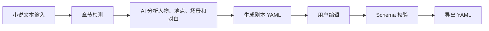

# Novel2Script

Novel2Script 是一款面向小说作者的 AI 辅助剧本创作工具。它可以将 3 个章节以上的小说文本转换为结构化剧本 YAML，帮助作者快速获得可编辑、可校验、可导出的剧本初稿。

## 项目简介

小说作者在把长篇文本改编成剧本时，通常需要反复整理章节、人物、地点、场景、对白和剧情节拍。Novel2Script 将这个过程拆成清晰的产品流程：先检测小说章节，再调用 AI 生成结构化剧本 YAML，最后让作者继续编辑、校验并导出结果。

本项目不是一次性生成不可修改的纯文本，而是把 AI 输出变成可继续打磨的结构化初稿。作者可以把它作为剧本创作、分镜开发或后续影视化改编的起点。

## 赛题对应说明

本项目对应赛题：

**题目三：AI 小说转剧本工具**

Novel2Script 对赛题要求的覆盖如下：

- 支持输入 3 个章节以上小说文本。
- 支持 AI 自动转换为结构化剧本。
- 输出 YAML 格式。
- 提供 YAML Schema 文档。
- Schema 文档说明字段设计原因。
- 提供 README。
- 预留 Demo 视频链接。
- 项目可在本地运行和评审。

## 核心功能

1. **多章节小说输入**  
   用户可以在首页粘贴小说文本，适合输入 3 个章节以上的故事内容。

2. **章节数量自动检测**  
   系统会识别 `第一章`、`第1章`、`章节一`、`Chapter 1`、Markdown 标题等常见章节格式，并展示章节列表。

3. **示例小说加载**  
   首页提供原创三章节示例小说，评委可以一键加载并快速体验完整流程。

4. **AI 小说转剧本 YAML**  
   前端调用 `/api/generate`，后端通过 OpenAI-compatible Chat Completions API 生成结构化剧本 YAML。

5. **YAML 在线编辑**  
   AI 生成结果会进入可编辑 YAML 编辑器，用户可以继续修改字段、场景和对白。

6. **YAML Schema 校验**  
   前端调用 `/api/validate`，后端使用 `js-yaml` 解析 YAML，并通过手写 Schema 校验逻辑检查结构。

7. **YAML 一键导出**  
   用户可以把当前编辑器中的内容导出为 `novel2script-output.yaml`。

8. **Schema 设计文档**  
   `docs/yaml-schema.md` 说明 Schema 顶层结构、字段含义、校验规则和设计取舍。

9. **示例输入与示例输出**  
   `examples/sample-novel.md` 提供原创小说示例，`examples/sample-script.yaml` 提供符合 Schema 的剧本 YAML 示例。

## 产品流程



## 技术栈

- Next.js App Router
- React
- TypeScript
- Tailwind CSS
- js-yaml
- OpenAI-compatible API
- Vercel 或本地 Node.js 环境

## 目录结构

```text
app/          Next.js App Router 页面与 API Route
components/   前端 UI 组件，包括小说输入和 YAML 编辑器
lib/          章节检测、LLM 调用、Prompt、YAML 解析和 Schema 校验逻辑
docs/         Schema 文档、Demo 指南和交付检查清单
examples/     示例小说输入和示例 YAML 输出
```

## 本地启动

1. 安装依赖：

```bash
npm install
```

2. 复制环境变量文件：

```bash
cp .env.example .env.local
```

3. 配置模型 API：

```text
OPENAI_API_KEY=你的 API Key
OPENAI_BASE_URL=OpenAI-compatible API 地址，可选
OPENAI_MODEL=模型名称，可选
```

4. 启动项目：

```bash
npm run dev
```

5. 打开浏览器访问：

```text
http://localhost:3000
```

## 环境变量说明

`OPENAI_API_KEY`  
模型服务 API Key，不可提交到仓库。

`OPENAI_BASE_URL`  
OpenAI-compatible API 地址。未配置时默认使用 `https://api.openai.com/v1`。

`OPENAI_MODEL`  
模型名称。未配置时默认使用 `gpt-4o-mini`。

## 使用方式

1. 打开首页。
2. 点击“加载示例小说”或粘贴自己的小说文本。
3. 确认检测到 3 个章节以上。
4. 点击“生成剧本 YAML”。
5. 查看并编辑生成结果。
6. 点击“校验 YAML”。
7. 校验通过后点击“导出 YAML”。

## YAML Schema 文档

完整文档见：

[docs/yaml-schema.md](docs/yaml-schema.md)

当前 Schema 包含以下顶层结构：

- `script`
- `chapters`
- `characters`
- `locations`
- `scenes`
- `metadata`

## 示例文件

- [examples/sample-novel.md](examples/sample-novel.md): 原创三章节小说示例。
- [examples/sample-script.yaml](examples/sample-script.yaml): 符合 Schema 的剧本 YAML 示例。

## Demo 视频

Demo 视频链接：待补充

最终提交前需要替换为可访问的视频链接，例如 bilibili、网盘或其他公开可访问平台。

## 依赖说明

- `next`: Web 应用框架。
- `react`: 前端组件渲染。
- `typescript`: 类型检查。
- `tailwindcss`: 页面样式。
- `js-yaml`: YAML 解析和校验前置处理。
- `@types/js-yaml`: `js-yaml` 的 TypeScript 类型声明。

## 原创功能说明

本项目原创实现部分包括：

- 小说章节检测逻辑。
- 剧本 YAML Schema 设计。
- AI 小说转剧本 Prompt。
- YAML 结构校验逻辑。
- YAML 编辑、校验、导出流程。
- 示例小说与示例 YAML。

## 当前状态

项目已经完成：

- 输入 3 章以上小说。
- AI 生成剧本 YAML。
- YAML 编辑。
- YAML Schema 校验。
- YAML 导出。
- Schema 文档。

## 后续可扩展方向

- 长篇小说分块处理。
- 角色对白单独优化。
- 多版本剧本管理。
- 剧本格式预览。
- 分镜脚本生成。
- 多模型切换。
